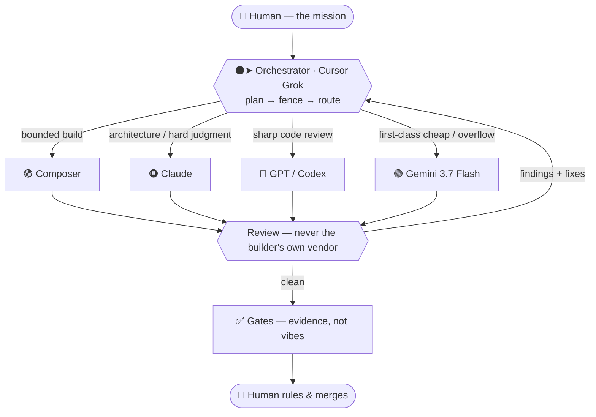

# ⚫➤ Anderson's Dispatch Deck

### **cursor-v2** — the Cursor edition

Heavy multi-model agentic orchestration — conducted from **one Cursor chat**.

**⚫➤ conducts. 🟣 Composer builds. Everybody else is a specialist.**

`•` no persona `•` no theater `•` right-model-right-job `•` honest review `•` meter-aware

> **You are on the Cursor branch.** The main talker is **⚫➤** — Grok inside Cursor, not Claude in a terminal.
> The original Claude-CLI deck still lives on [`main`](https://github.com/medick51o/andersons-dispatch-deck).
> Same engine ([`SPINE.md`](SPINE.md)). New seats. More landing in the coming days.

---

> **Status note, 23 Aug 2026.** This branch was written on the premise that in Cursor, the Cursor
> chat conducts and Claude is a called CLI. Extensive live testing since has landed somewhere
> different: **Cursor works best as a metered RESERVE BENCH driven from Claude Code**, not as the
> conductor. The trunk now carries that doctrine as law — SPINE v2.4's `THE TRANSPORT LAW`,
> `THE COUNCIL SEAT LAW` and `THE METER LAW`, plus `MEASURING-POOLS.md` and the `mcp-seats/` tooling,
> all of which are now on this branch too.
>
> What survives from this branch and was promoted to the trunk: the **➤ arrow** (it is a *cursor* —
> that is its birthplace), the **red-dot-on-the-seat** reviewing mark, **⛔** for reject so it can
> never be confused with reviewing, the **🌈👥👥** council mark, and the **meter wraps**, which now
> earn their keep on reserve lines.
>
> The Cursor-native loader that once lived here is archived at `legacy/cursor-native/` on the trunk.
> Treat this branch as the **Cursor-edition landing page and emoji legend**, not as a live method.

## What it is

Most people talk to one AI. **ADD treats models as a toolbox with a foreman.**

In Cursor, that foreman is **⚫➤** (this Grok chat). It reads the job, fences the files, sends the work to the model that's actually best for it, gets a *different* line to look at the result, runs the gates, and reports back in plain language.

No four terminals. No "it works." No theater.

It's the straight-faced sibling of *Team Rocket Takes Over*: same engineering spine, none of the show.

---

## How a job flows *(this branch)*

---

## The arsenal *(Cursor edition)*

| | Seat | Best at | Dispatch it for |
|:--:|---|---|---|
| ⚫➤ | **Grok** *(this Cursor chat)* | conducting the deck | plan · fence · Gate-0 · the one talking to you. Parallel Grok Tasks wear this same badge and **cannot** review it |
| 🟣 | **Composer 2.5** | fast, bounded builds | tickets the conductor fenced — **never** the main talker, **never** independent review of Grok |
| 🟠 | **Claude** | deepest reasoning | architecture · specs · hard judgment — **not** daily conductor in Cursor |
| 🔵 | **GPT-5.6 Sol / Codex** | precise builds; the review that *proves* bugs | code review of work it did **not** build |
| 🟢 | **Gemini 3.7 Flash** | first-class speed + an independent vote | real work + cheap honest reads — **not a spare tire** |

Two harnesses, one method:

| Harness | When | Who pays |
|---|---|---|
| **Cursor-native** | daily drive inside this IDE | Cursor Models (Grok + Composer) · Other Models only when you *name* them |
| **CLI overflow** | you explicitly want Claude Max / Codex / `agy` / Grok CLI | those subscriptions — not the Cursor meter |

## The legend *(cursor-v2)*

**Seat first, act second, meter wrap around the words.**  
A line looks like: `🔵🔴 💸 Codex reviewing Grok's parser 💸`

On [`main`](https://github.com/medick51o/andersons-dispatch-deck) the conductor is still **🟡** gold (Claude in a terminal) and Composer did not exist. This branch is the Cursor wardrobe.

### Seats

| | Who | Job |
|:--:|---|---|
| ⚪ | **The boss** (you) | Only person who merges. Reality outranks the bench |
| ⚫➤ | **Grok** *(this Cursor chat)* | Conductor. Plans, fences, talks to you. Parallel Grok Tasks wear this same badge and cannot review it |
| 🟣 | **Composer 2.5** | Bounded builder. Never the main talker. Never independent review of Grok |
| 🟠 | **Claude** | Architecture, specs, hard judgment |
| 🔵 | **GPT / Codex** | Precise builds; the review that *proves* a bug |
| 🟢 | **Gemini 3.7** | First-class cheap work + an independent vote |
| 🟠🟢 | **Borrowed brain** | Banner never lies: Claude-brain on a Gemini host (both colors) |

### Acts

| | Meaning |
|:--:|---|
| 🔨 | **Building** — writing the files |
| 🔴 | **Reviewing** — suffix on the seat. **🔵🔴** = Codex is reviewing. Not a reject |
| ⛔ | **Rejected / blocked / needs the boss.** Never use 🔴 for this |

### Meter wrap *(same mark at both ends of the words)*

| Wrap | When |
|---|---|
| **♾️ … ♾️** | Already on a sub. **Not** Cursor plan credits — this chat, Composer, a CLI you already pay for |
| **💸 … 💸** | Burning **Cursor plan credits** — Other Models Tasks (Claude / GPT / Gemini inside Cursor) |
| **🚨💳 … 🚨💳** | **Known** real API bill — Anthropic invoice, ChatGPT recharge, BYOK. Never guess. Unsure → ♾️ or 💸 |

### States *(the rest of the palette — kept from the Deck)*

| | Meaning |
|:--:|---|
| 🚩 | Finding raised. Flagged, not fatal |
| 🚧 | Lane closed, detour in progress |
| 🌈👥👥 | **Council** — every color, a crowd. Ask first. (🟣 is Composer now; council is not purple) |
| 🧪 | Gates running |
| 🩺 | Diagnosing (doctor-first, before a pile of builders) |
| 🕵️ | Adversary loose — refute / try-to-kill-it lens |
| 🏁 | Boss-validated. Top rung. Outranks “done” |
| 🚢 | Shipped / deployed |
| 🪦 | Retired / parked |
| 🟤 | Quiet hold. Nothing running, watchers armed |
| ⚪🏁 | Boss in-hand check |
| ⚪⚖️ | Ruling pending from the boss |
| ⚪🎮 | Boss on the sticks |

### Situations

**Included build** — Composer is on the Cursor sub, not the Other Models tank:

> 🟣🔨 ♾️ Composer building the parser in `src/parser.ts` ♾️

**Cursor credits leaving** — you named Codex in Cursor to review Grok’s work. Other Models pool:

> 🔵🔴 💸 Codex reviewing Grok's parser — proving the empty-input path 💸

**Reviewer said no** — same credit burn, stop sign not a second red dot:

> 🔵🔴→⛔ 💸 Codex rejected the parser: empty input panics. Fix attached 💸

**Real API bill** — Cursor tank is empty (or BYOK) and Anthropic / OpenAI will invoice. Only when you *know*:

> 🟠🔴 🚨💳 Claude reviewing on Anthropic API — Cursor Other Models is empty 🚨💳

**Council** — special move, every vendor, one question, you said go:

> 🌈👥👥 💸 council in session — four lenses on the auth fork 💸

**Doctor first** — something’s broken; don’t spawn a fleet yet:

> 🩺 ♾️ diagnosing the failed gate before anyone else builds ♾️

**Finding, not a reject** — reviewer caught something, build continues:

> 🔵🔴 💸 Codex reviewing 💸 → 🚩 empty-input panic · fix attached

**Quiet night** — work landed, nothing in flight:

> 🚢 shipped · ⚪🏁 boss already checked it · 🟤 quiet hold

**CLI gold** — if you open [`main`](https://github.com/medick51o/andersons-dispatch-deck), the conductor is **🟡** and review used to be 📝. That wardrobe stays on the Claude-CLI trunk.

---

## The rules that make it trustworthy

1. **A reviewer never wears the builder's own vendor.** Grok cannot review Grok. Composer verifying Grok is a **check**, not cross-vendor independence.
2. **Right model for the job — and cost-aware.** The deck reads the plan before it spawns anyone. No surprise Claude on a $20 tank.
3. **The banner never lies.** If the shop is Grok + Composer only, it says **solo-vendor degraded** — it does not print "full cross-vendor."
4. **Findings ship fixes.** Reviews land at checkpoints and never freeze the build.
5. **Gates before "done."** *"Gates pass."* Never *"it works."* The human is the final merge.
6. **No unasked fleets.** A two-line ask is one seat. A council is a special move, and it **asks first**.

---

## Status

This branch is the Cursor reseat. The method is proven; the Cursor wardrobe is being written now.

- [x] Branch cut from the public deck
- [x] Seats named: ⚫➤ conducts · 🟣 Composer · Gemini 3.7 first-class
- [x] Review = red dot on the seat (**🔵🔴**). Reject = **⛔**. Council = **🌈👥👥** (🟣 is Composer)
- [x] Meter wrap: **♾️** included · **💸** Cursor credits · **🚨💳** real API bill (known only)
- [ ] Skill rewrite (`SKILL.md` + Cursor-native guide)
- [ ] Dual-harness switch (`cursor` · `cli` · `off`) without the wrong-meter oops
- [ ] Console + dispatch guide updated for this wardrobe

Star the repo, switch the branch dropdown to **`cursor-v2`**, and watch it grow.

---

## Quick start *(today)*

**Claude CLI trunk** (stable, on `main`):

1. Install the vendor CLIs you want — see [`SETUP.md`](SETUP.md). All optional; Claude alone is a valid, degraded deck.
2. Drop [`SKILL.md`](SKILL.md) **and** [`SPINE.md`](SPINE.md) into `~/.claude/skills/dispatch/`.
3. Run **`/dispatch`**.

**Cursor edition** (this branch — landing now):

1. Stay in Cursor. This chat is already **⚫➤**.
2. The Cursor skill lives with your user skills (`dispatch on` / `/dispatch`).
3. Don't switch the model picker to "be" Claude. Dispatch Claude as a worker, or don't.

---

## In this repo

| File | What |
|---|---|
| [`SKILL.md`](SKILL.md) | loader — Claude-CLI trunk today; Cursor rewrite coming on this branch |
| [`SPINE.md`](SPINE.md) | **the shared engine** — same one TRM and TRTO run |
| [`SETUP.md`](SETUP.md) | install · auth · gotchas |
| [`FIELD-NOTES.md`](FIELD-NOTES.md) | proven capabilities a fresh install inherits |
| [`MODEL-DISPATCH-GUIDE.md`](MODEL-DISPATCH-GUIDE.md) | who-to-send-where (CLI wardrobe; Cursor guide coming) |
| [`dispatch-console.html`](dispatch-console.html) | color-coded visual quick-reference |

---

## Part of a family

Same engine underneath; the other tiers add personality:

| Tier | Repo | What you get |
|---|---|---|
| ⚫➤ **Anderson's Dispatch Deck** *(you're here)* | this repo · branch **`cursor-v2`** | Cursor Grok conducts · 🟣 Composer builds · straight-faced |
| 🟡 **ADD · CLI trunk** | [`main`](https://github.com/medick51o/andersons-dispatch-deck) | Claude conducts from the terminal |
| 🟠 **Team Rocket Method** | **[→ team-rocket-method](https://github.com/medick51o/team-rocket-method)** | SPINE + a permanent crew |
| 🚀 **Team Rocket Takes Over** | **[→ team-rocket-takes-over](https://github.com/medick51o/team-rocket-takes-over)** | SPINE + crew + the full show |

---

*Reserved future rebrand: **Agentic Dispatch Director** (also ADD).*

Built with heavy AI collaboration, and honest about it.
The value is the **method**: the roles stay; the models are the costumes.

**Share this branch:** [github.com/medick51o/andersons-dispatch-deck/tree/cursor-v2](https://github.com/medick51o/andersons-dispatch-deck/tree/cursor-v2)

