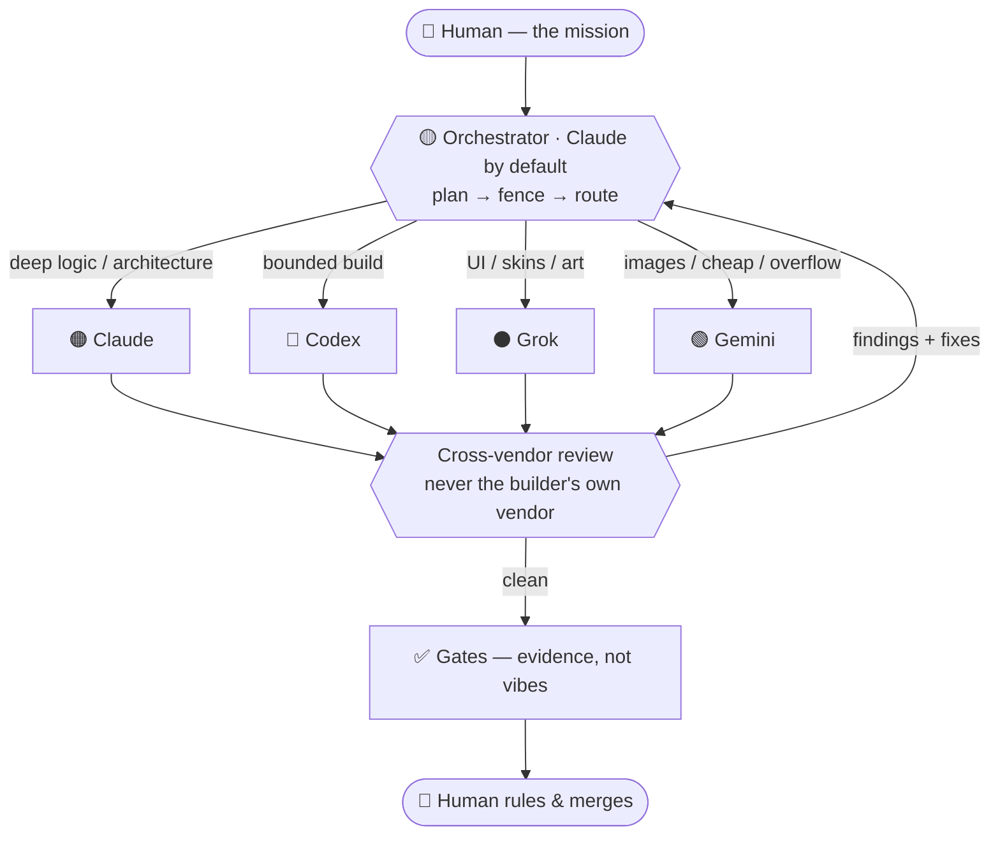

# 🟡 Anderson's Dispatch Deck

### Heavy multi-model agentic orchestration — conducted from a single chat window.

**One conductor. Four AI vendors. Zero terminal-juggling.**

Claude · Codex · Grok · Gemini — dispatched to their strengths, reviewed across vendors,
gated, and reported plainly. The powerhouse, straight-faced.

`•` no persona `•` no theater `•` right-model-right-job `•` honest cross-vendor review `•` cost-aware

**`spine v2.8`** `•` persistent seats `•` a 200-model bench `•` spend gated by consent `•` meters read, never guessed

---

## What's in it now — the short list

| | Feature | What it means for you |
|:--:|---|---|
| 🔌 | **Persistent seats, not amnesia** | Brief a vendor once, get a session id, continue that exact conversation later. Reviewers stay fresh calls on purpose. |
| 🟣 | **The Cursor bench — 200+ models** | One CLI is a doorway to the whole roster. Two of them draw on the plan rather than credits, so routine work is effectively free. |
| 💳 | **Spend gated by consent** | A seat that *can* spend needs a recorded allowance first — a bound, with an expiry. No allowance, no spend. Free seats never ask. |
| 📊 | **Meters read, never guessed** | Live usage pulled from each vendor's own billing endpoint. Cost claims cite a reading, not a recollection. |
| 🛡️ | **Read-only actually read-only** | Three real escape routes found and closed: argument injection through a Windows shim, a "read-only" flag that only meant *authorize*, and a seat escalating by driving another seat. |
| 🧪 | **An arm test that says what it actually did** | `armcheck.py` validates the guards free and in a second; `--deep` *attacks* the seats and only then claims ALL ARMED. |
| ⚖️ | **Contradiction-swept law** | A four-vendor blind council re-read the engine and found nine places two rules disagreed. All nine repaired. |
| 🪶 | **Deliberately small** | The engine states rules, not its own history. Dates, incident scars and shop wiring were cut so a stranger doesn't pay for them on every prompt — the load is a third lighter than it was, with no rule changed. |

## What it is

Most people talk to one AI. **ADD treats models as a toolbox with a foreman.** A single
orchestrator — **Claude by default, because most of us drive the Claude CLI** — runs the conductor role
(it wears **gold** 🟡, above the players; the seat is *model-agnostic* — a Codex-first shop puts Codex in
gold and Claude in support). It reads each job, sends it to the model that's actually best for it, has a
*different* vendor review the result, runs the gates, and reports back. No four
terminals, no guessing, no drift.

It's the straight-faced sibling of *Team Rocket Takes Over*: same engineering spine,
none of the show.

## How a job flows

## The arsenal

| | Model | Best at | Dispatch it for |
|:--:|---|---|---|
| 🟠 | **Claude** (Anthropic) | deepest reasoning, architecture, honest judgment | design & specs · root-cause · engine-grade logic · reviewing others |
| 🔵 | **Codex** (OpenAI) | precise builds; the sharpest code review (*proves* bugs) | bounded implementation · reviewing Claude/Grok/Gemini code |
| ⚫ | **Grok** (xAI) | fearless one-shot visual design | UI · skins · concept pages · "make it feel like X" |
| 🟢 | **Gemini** (Google / Antigravity) | budget builder · **image gen (Nano Banana)** · overflow capacity | real builds · renders · cheap sweeps · an independent 4th vote |
| 🟣 | **The Cursor bench** | one CLI, **200+ models** — its own house models plus most of the majors | routine work on the plan's free half · a wide 5th opinion · reaching a model you don't hold a sub for |

### 🟣 About the bench

The Cursor seat is different in kind: it isn't one model, it's a *roster*. That makes the
important question **which half of the pool a call lands in**, so the seat enforces it:

- **The plan's own models** (its house builder, and its hosted Grok) draw on the subscription. These are the default, and they're where routine work goes.
- **Everything else** — Claude, GPT, Gemini, and the open-weight models — bills credits at API rates, and the seat **refuses to touch them without a recorded allowance.**

A lesson worth stealing: our first head-to-head said the bench's hosted Grok was clearly
worse than the standalone CLI. It wasn't. **We'd given it fewer tool permissions** — we were
measuring our own harness. Level the permissions and they matched. If you benchmark a budget
tier, check that first.

## The rules that make it trustworthy

1. **A reviewer never wears the builder's own vendor.** Cross-vendor, or it's just a mirror — different training, different blind spots, real catches.
2. **Right model for the job — and cost-aware.** Dispatch weighs the meter, not just capability (heavy Claude work can fail over to a cheaper lane and keep going).
3. **The banner never lies.** When a model wears a borrowed brain, both are shown (`🟠🟢`).
4. **Findings ship fixes.** Every finding carries a suggested fix. Reporting and stopping are different acts: a finding may be filed the moment it's found, but only a genuine blocker halts a lane — and only that lane.
5. **Gates before "done."** Claims capped at evidence — *"gates pass,"* never *"it works."* The human is the final gate and the only one who merges.
6. **No unasked fleets.** Parallel builders on disjoint files are declared and bounded; an N-way panel on one question needs your explicit go. Neither hides behind the other.
7. **The dispatch gate decides who *builds*, never whether the result is *reviewed*.** An orchestrator that builds is a builder like anyone else.
8. **Nothing spends without consent.** A seat that can bill needs a recorded allowance — bounded, and expiring by default. Unknown cost fails closed.

## The Council — every vendor, one question

For a call that has to be *right* — a design fork, a decision, a claim that must survive scrutiny — the Deck convenes **the council**: it dispatches the same question to **a bounded set of eligible vendors at once** (the cap is set in advance; *"as many as it takes"* is not a number), each handed a distinct lens (correctness · cost · *refute-it*), gathers the independent reads, synthesizes best-of-breed with **every disagreement named**, caps the debate at two rounds, and hands you the verdict. Four vendors mean four sets of blind spots — the special move for when one model's read isn't enough. No cast, no theater: just the panel, reported by model name. It's **stakes-gated** — a two-line ask (*"rewrite this email," "did I send the PO"*) is handled by one seat, **never** a council. *(Same engine move as TRM's crew council and TRTO's set-piece — here it's straight-faced.)*

## In this repo

| File | What |
|---|---|
| [`SKILL.md`](SKILL.md) | the `/dispatch` loader — drop it **+ [`SPINE.md`](SPINE.md)** into a Claude CLI and Claude becomes the conductor |
| [`SPINE.md`](SPINE.md) | **the shared engine** — the whole method, brand-neutral; the *same* SPINE that TRM and TRTO run |
| [`SETUP.md`](SETUP.md) | install · auth · gotchas · the reachability probe |
| [`FIELD-NOTES.md`](FIELD-NOTES.md) | proven capabilities a fresh install inherits (so it doesn't re-learn what's already known) |
| [`MODEL-DISPATCH-GUIDE.md`](MODEL-DISPATCH-GUIDE.md) | the deep who-to-send-where playbook |
| [`dispatch-console.html`](dispatch-console.html) | a color-coded visual quick-reference |
| [`mcp-seats/`](mcp-seats/) | **the wiring** — one small MCP server per vendor, plus the guards |
| [`mcp-seats/allowance.py`](mcp-seats/allowance.py) | the spend record a metered seat checks before it bills |
| [`mcp-seats/armcheck.py`](mcp-seats/armcheck.py) | the canaries — free by default, `--deep` to attack the seats for real |
| [`mcp-seats/read-meters.py`](mcp-seats/read-meters.py) | live usage, straight from each vendor's billing endpoint |
| [`MEASURING-POOLS.md`](MEASURING-POOLS.md) | **how to measure a usage pool a vendor won't publish** — generalizes to any vendor |
| [`BENCH-LEDGER.md`](BENCH-LEDGER.md) | the bench roster: which models are free, which bill, and their track records |
| [`SPINE-PROVENANCE.md`](SPINE-PROVENANCE.md) | the war stories behind the laws — kept, but never loaded on a summon |

## Quick start

1. Install the vendor CLIs you want in the arsenal (see [`SETUP.md`](SETUP.md)) — **all are
   optional; Claude alone is a valid, degraded deck.**
2. Drop [`SKILL.md`](SKILL.md) **and [`SPINE.md`](SPINE.md)** into `~/.claude/skills/dispatch/`.
3. In a Claude CLI, run **`/dispatch`** (or just say *"run the dispatch deck"*). It probes
   what's online, declares the live arsenal, and asks for the job.

## Part of a family — try the other tiers

ADD is the straight-faced tier. Same engine underneath; two siblings add personality — **worth a look:**

| Tier | Repo | What you get |
|---|---|---|
| 🟡 **Anderson's Dispatch Deck** *(you're here)* | this repo | the engine, straight-faced — model names, no cast |
| 🟠 **Team Rocket Method** | **[→ team-rocket-method](https://github.com/medick51o/team-rocket-method)** | SPINE + a permanent crew — named seats, adversarial cross-reviews |
| 🚀 **Team Rocket Takes Over** | **[→ team-rocket-takes-over](https://github.com/medick51o/team-rocket-takes-over)** | SPINE + crew + the full show — the agentic-AI playground, cast & cat |

Promote up the tiers when you want more personality; the discipline underneath is identical.

---

## 🔥 Bonus: Fuel mode — a language register you turn on (OFF by default)

Some brains don't run on importance. They run on **interest, novelty, challenge, urgency** — and
they actively push back against being told what to do, even for a task the person was already
walking toward. That's an interest-based nervous system (common with ADHD) meeting
**psychological reactance**, and it's why *"you should really finish that parser"* can kill the
motivation it was meant to create.

Fuel mode is one line of defense against that. Say **`/dispatch fuel`** (or *"fuel on"*, *"adhd
mode"*) and the conductor's narration switches register — your next move gets framed as a bet, a
challenge, or a countdown instead of an instruction:

> 🟡 lanes fenced. The parser bite is yours — I say it takes you twenty minutes. **Prove me wrong.**

The guardrails matter as much as the feature:

- **Off unless you turn it on**, and it never survives silently into a new session.
- **Earned, not metronomic.** It fires at bite-starts, visible stalls, and gate-passes. Most lines
  stay plain — a constant firehose becomes noise within the hour.
- **Never a taunt on a real failure.** A failed gate gets the doctor treatment 🩺, not the needle.
- **A finished job closes on the high note**, never a jab.
- **Verbiage only.** It cannot touch routing, verdicts, evidence rank, tickets, or reports —
  findings and gates always print plain. This is still not the show.
- **`fuel off` or `drop it` kills it instantly.** The dial is yours.

*In the [Team Rocket](https://github.com/medick51o/team-rocket-method) tiers this isn't a toggle —
it's simply how the Cat talks, plus a rival character who bets against you. Here it stays opt-in,
because the Deck's default is straight-faced.*

---

## Lineage

ADD grew from the **Team Rocket Method (TRM)** — the original two-model-shop discipline —
and is the *straight-faced* cut of its playful successor, *Team Rocket Takes Over*. It keeps
the engineering (fenced tickets, cross-vendor review, gates, decision batching) and drops
the persona. Credit to TRM as the trunk this branch grew from. 🫡

---

*Reserved future rebrand: **Agentic Dispatch Director** (also ADD).*

Built with heavy AI collaboration, and honest about it — that's the house rule.
The value is the **method**: vendor-proof, because the roles are permanent and the models
are just the costumes they wear.

